# 🏗️ Pushly — Full System Design

> **Pushly** is a static frontend deployment platform (like Vercel/Netlify).
> Users push code → GitHub Actions triggers a build → files land on S3 → served via Cloudflare Worker.

---

## 📐 High-Level Architecture


---

## 🔄 Complete Flow: Push → Build → Deploy → Serve

### Phase 1: CI/CD Trigger (GitHub Actions)

```mermaid
sequenceDiagram
    participant DEV as Developer
    participant GH as GitHub
    participant GHA as GitHub Actions
    participant API as API Server

    DEV->>GH: git push (any branch)
    GH->>GHA: Trigger workflow

    GHA->>GHA: Determine Environment
    Note over GHA: main branch → PRODUCTION<br/>other branches → STAGING

    GHA->>API: POST /api/projects/{PROJECT_ID}/deployments
    Note over GHA,API: Headers: Authorization: Bearer {PUSHLY_TOKEN}<br/>Body: { gitCommitHash, gitBranch, environment }

    API-->>GHA: { id: "deployment-id", status: "QUEUED" }

    GHA->>API: POST /api/projects/{PROJECT_ID}/deployments/{DEPLOYMENT_ID}/deploy?environment=PRODUCTION
    Note over GHA,API: Headers: Authorization: Bearer {PUSHLY_TOKEN}

    API-->>GHA: { status: "RUNNING", ecsTaskArn: "..." }
    GHA->>GHA: echo "🎉 Deployment triggered"
```



**GitHub Secrets Required:**
| Secret | Value |
|--------|-------|
| `PROJECT_ID` | Your Pushly project ID |
| `PUSHLY_TOKEN` | JWT token from Pushly dashboard |
| `SLACK_WEBHOOK_URL` | (Optional) Slack notifications |

---

### Phase 2: API Server → ECS Trigger


**ECS Environment Variables Injected:**
```
GIT_URL          → project.gitURL
GIT_REF          → deployment.gitBranch
ENV              → PRODUCTION | STAGING
PROJECT_ID       → project.id
DEPLOYMENT_ID    → deployment.id
INTERNAL_TOKEN   → INTERNAL_PROXY_TOKEN secret
API_URL          → https://api.wareality.tech
GITHUB_TOKEN     → (if private repo, encrypted in DB)
```

---

### Phase 3: Build Container Execution

```mermaid
sequenceDiagram
    participant MAIN as main.sh
    participant REDIS as Upstash Redis
    participant SCRIPT as script.js
    participant API as API Server
    participant S3 as AWS S3

    MAIN->>REDIS: XADD "📦 Cloning repository..."
    MAIN->>MAIN: git clone {GIT_URL}
    MAIN->>MAIN: git checkout {GIT_REF}
    MAIN->>REDIS: XADD "✅ Repository cloned"
    MAIN->>SCRIPT: exec node script.js

    SCRIPT->>SCRIPT: detectFramework(outDirPath)
    Note over SCRIPT: Checks package.json, angular.json,<br/>app.json for 14 frameworks

    SCRIPT->>SCRIPT: validateFramework()
    Note over SCRIPT: Next.js: checks output:'export'<br/>in next.config.js/.mjs/.ts

    SCRIPT->>SCRIPT: resolveConfig()
    Note over SCRIPT: Priority: UI vars > gitway.config.json > auto-detect

    SCRIPT->>API: POST /internal/deployments/{id}/framework-detected
    Note over SCRIPT,API: { framework, buildCommand, installCommand, outputDirectory }

    SCRIPT->>REDIS: XADD "🔧 Installing dependencies..."
    SCRIPT->>SCRIPT: Run installCommand (npm ci / yarn / pnpm)

    SCRIPT->>REDIS: XADD "🏗️ Building..."
    SCRIPT->>SCRIPT: Run buildCommand (npm run build)

    alt Angular project
        SCRIPT->>SCRIPT: resolveAngularDeployDir()
        Note over SCRIPT: Detects Angular version<br/>≤15: dist/app/<br/>16+: dist/app/browser/
    end

    SCRIPT->>SCRIPT: walkAndUpload(distFolderPath)
    loop For each file in output dir
        SCRIPT->>S3: PutObject(__outputs/{projectId}/deployments/{deploymentId}/{file})
    end

    SCRIPT->>API: POST /internal/deployments/{id}/complete
    Note over SCRIPT,API: X-Internal-Token header required
```



---

### Phase 4: Log Pipeline

```mermaid
sequenceDiagram
    participant BUILD as Build Container
    participant REDIS as Upstash Redis Stream
    participant LOG as Log Service (Java)
    participant DB as PostgreSQL

    BUILD->>REDIS: XADD container-logs * { projectId, deploymentId, timestamp, log }

    loop Every 2 seconds (blocking)
        LOG->>REDIS: XREADGROUP GROUP log-group consumer-1 COUNT 10 BLOCK 2000
        REDIS-->>LOG: List of StreamEntry

        loop For each entry
            LOG->>DB: INSERT deployment_logs (projectId, deploymentId, timestamp, message)
            LOG->>REDIS: XACK container-logs log-group {entryId}
        end

        Note over LOG,REDIS: ⚠️ Missing: XTRIM to delete processed messages!
    end
```



**⚠️ Current Issue:** `XACK` marks as read but doesn't delete → 8,882 messages accumulating → hitting Upstash 500K command limit.

**Fix needed:**
```java
// Add after processing batch:
jedis.xtrim(streamKey, 1000, true);
```

---

### Phase 5: Serve Flow (End User)


**URL Formats:**
| Environment | URL Pattern |
|------------|-------------|
| Production | `https://{subdomain}.wareality.tech` |
| Staging | `https://{deploymentId}--{subdomain}.wareality.tech` |
| Custom Domain | `https://yourdomain.com` (via Cloudflare proxy) |

---

## 📡 Key API Endpoints

### Public API (JWT Auth Required)

| Method | Endpoint | Description |
|--------|----------|-------------|
| `POST` | `/api/auth/login` | Login → JWT token |
| `POST` | `/api/auth/register` | Register new user |
| `POST` | `/api/projects` | Create project |
| `GET` | `/api/projects` | List user's projects |
| `GET` | `/api/projects/{id}` | Get project details |
| `POST` | `/api/projects/{id}/deployments` | Create deployment (step 1) |
| `POST` | `/api/projects/{id}/deployments/{id}/deploy` | Trigger build (step 2) |
| `GET` | `/api/projects/{id}/deployments` | List deployments (paginated) |
| `GET` | `/api/projects/{id}/deployments/{id}` | Get deployment details |
| `POST` | `/api/projects/{id}/deployments/{id}/promote` | Promote staging → production |
| `POST` | `/api/projects/{id}/deployments/{id}/rollback` | Rollback to previous |
| `POST` | `/api/projects/{id}/deployments/{id}/stop` | Stop running ECS task |
| `DELETE` | `/api/projects/{id}/deployments/{id}` | Delete deployment |
| `GET` | `/api/projects/{id}/deployments/active` | Get active deployments per env |

### Internal API (X-Internal-Token Required)

| Method | Endpoint | Caller | Description |
|--------|----------|--------|-------------|
| `POST` | `/internal/deployments/{id}/framework-detected` | Build Server | Report detected framework + config |
| `POST` | `/internal/deployments/{id}/complete` | Build Server | Mark build SUCCESS |
| `POST` | `/internal/deployments/{id}/failed` | Build Server | Mark build FAILED |
| `GET` | `/internal/cf/projects/resolve?subdomain=X` | Cloudflare Worker | Resolve subdomain → project |

---

## 🗄️ Data Models

### Project
```
id                    UUID
name                  String
subdomain             String (unique, e.g. "myapp")
gitURL                String
userId                String (FK → User)
maxConcurrentDeployments  Int (default: 3)
customBuildCommand    String? (UI override)
customInstallCommand  String? (UI override)
customOutputDirectory String? (UI override)
activeProductionDeploymentId  String?
activeStagingDeploymentId     String?
```

### Deployment
```
id                  String (generated: {env}-{commitHash})
projectId           String (FK → Project)
status              QUEUED | DEPLOYING | RUNNING | SUCCESS | FAILED
environment         PRODUCTION | STAGING
gitCommitHash       String
gitBranch           String
version             Int (auto-incremented per project)
ecsTaskArn          String? (AWS task ARN)
deployedUrl         String?
errorMessage        String?
detectedFramework   String? (expo, nextjs, angular, vite, ...)
buildCommand        String? (resolved)
installCommand      String? (resolved)
outputDirectory     String? (resolved)
lastAction          DEPLOYED | PROMOTED | ROLLED_BACK
createdAt           LocalDateTime
deployedAt          LocalDateTime?
```

### DeploymentLog
```
id            Long (auto)
projectId     String
deploymentId  String
timestamp     Instant
message       String
```

---

## 🔧 Framework Detection

Supported frameworks (auto-detected in order):

| Framework | Detection Signal | Default Build Dir |
|-----------|-----------------|-------------------|
| Expo | `app.json` with `expo` key | [dist](file:///Users/abdul/Desktop/pushly%20workspace%20all%20things/dainikinfo/dist) |
| Angular | `angular.json` exists | `dist/{appName}` (or `browser/`) |
| Next.js | `next` in dependencies | `out` (requires `output:'export'`) |
| Vite | `vite` in devDependencies | [dist](file:///Users/abdul/Desktop/pushly%20workspace%20all%20things/dainikinfo/dist) |
| CRA | `react-scripts` in dependencies | `build` |
| Gatsby | `gatsby` in dependencies | [public](file:///Users/abdul/Desktop/pushly%20workspace%20all%20things/frontend/public) |
| Nuxt.js | `nuxt` in dependencies | `.output/public` |
| Vue CLI | `@vue/cli-service` in devDeps | [dist](file:///Users/abdul/Desktop/pushly%20workspace%20all%20things/dainikinfo/dist) |
| SvelteKit | `@sveltejs/kit` in devDeps | `build` |
| Svelte | `svelte` in devDeps | [public](file:///Users/abdul/Desktop/pushly%20workspace%20all%20things/frontend/public) |
| Astro | `astro` in devDeps | [dist](file:///Users/abdul/Desktop/pushly%20workspace%20all%20things/dainikinfo/dist) |
| Remix | `@remix-run/react` in deps | [public](file:///Users/abdul/Desktop/pushly%20workspace%20all%20things/frontend/public) |
| SolidJS | `solid-js` in deps | [dist](file:///Users/abdul/Desktop/pushly%20workspace%20all%20things/dainikinfo/dist) |
| Qwik | `@builder.io/qwik` in deps | [dist](file:///Users/abdul/Desktop/pushly%20workspace%20all%20things/dainikinfo/dist) |

**Config Override Hierarchy:**
```
UI Environment Variables (UI_BUILD_COMMAND, UI_INSTALL_COMMAND, UI_OUTPUT_DIR)
        ↓ (if not set)
gitway.config.json in repo root
        ↓ (if not set)
Auto-detected defaults
```

---

## 🏛️ Infrastructure

| Component | Service | Details |
|-----------|---------|---------|
| API Server | AWS EC2 / ECS | Spring Boot, port 8080 |
| Build Runner | AWS ECS Fargate | On-demand, 1 task per deployment |
| Database | AWS RDS PostgreSQL | Persistent storage |
| File Storage | AWS S3 | Static build outputs |
| Log Stream | Upstash Redis | Redis Streams (container-logs) |
| Log Consumer | Spring Boot | log-service-kafka/ |
| CDN + Proxy | Cloudflare Worker | Edge serving, KV routing |
| Domain Routing | Cloudflare KV | resolve:{subdomain} → projectId |
| Container Registry | AWS ECR | build-server Docker image |

---

## 🔐 Security

| Token | Used By | Header |
|-------|---------|--------|
| JWT (user) | Frontend → API | `Authorization: Bearer {token}` |
| PUSHLY_TOKEN | GitHub Actions → API | `Authorization: Bearer {token}` |
| INTERNAL_PROXY_TOKEN | Build Server → API | `X-Internal-Token` |
| INTERNAL_PROXY_TOKEN | Cloudflare Worker → API | `X-Internal-Token` |
| GITHUB_TOKEN | Build Server → GitHub | Injected into git clone URL |
| CLOUDFLARE_API_TOKEN | API → Cloudflare KV | `Authorization: Bearer` |

---

